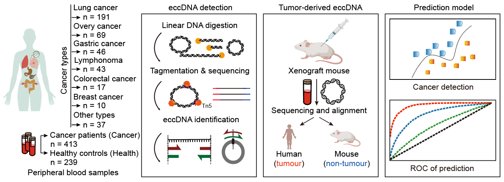

# ScanTecc
### The scripts for article "Detection of primary cancer types via fragment size selection in circulating cell-free extrachromosomal circular DNA".

## Getting Stared
The repository contains efp_parallel.py, a multi-processing script designed to identify extrachromosomal circular DNA (eccDNA) fusion junctions from raw sequencing data. The code processes an input BAM file to detect fusion events indicative of eccDNA. The repository also includes the code necessary to reproduce the results presented in the manuscript.

## Requirements
Python 3.7+; \
pysam for reading and querying BAM files; \
parser.py implementing parse_fusion_bam and Segment classes; \
Sufficient CPU cores (multi-processing support).

## Workflow Overview

### Alignment & Preprocessing
Align raw FASTQ reads to the reference genome (e.g., using BWA or Bowtie2).\
Sort and index the resulting BAM:\
    samtools sort -o sample.sorted.bam sample.bam\
    samtools index sample.sorted.bam
### eccDNA fusion detection
Run the efp_parallel.py script on the sorted BAM:\
    python efp_parallel.py sample.sorted.bam <num_CPUs> eccDNA_candidates.tsv

Parameters:\
    sample.sorted.bam: indexed BAM file from alignment;\
    <num_CPUs>: number of CPU cores to parallelize across;\
    eccDNA_candidates.tsv: output file.
### Output interpretation
The script writes a tab-separated file with the following columns:\
    name: Fusion event identifier (e.g., FUSIONJUNC_1);\
    chr, start, end: Genomic coordinates of the putative circular junction;\
    count: Number of supporting read pairs;\
    mate_mapped, mate_mapping_quality: Mate alignment metrics;\
    l_mapped, r_mapped: Read coverage on left/right segments;\
    left_linear_reads, left_circ_reads, left_mate_ss, left_mate_ds: Read classification around the left breakpoint;\
    right_linear_reads, right_circ_reads, right_mate_ss, right_mate_ds: Same metrics around the right breakpoint.
### Example usage
Identify eccDNA candidates using 8 threads:/
python efp_parallel.py patient1.sorted.bam 8 patient1_eccDNA.tsv
#### Notes: Ensure the BAM file includes SA tags (supplementary alignments) to capture split reads.

    
